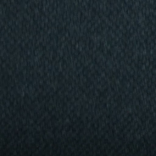
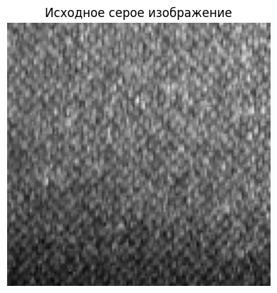
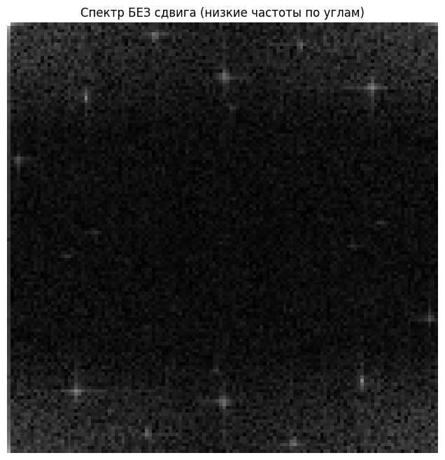
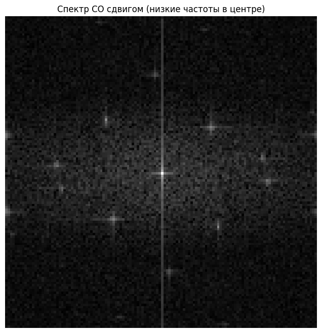
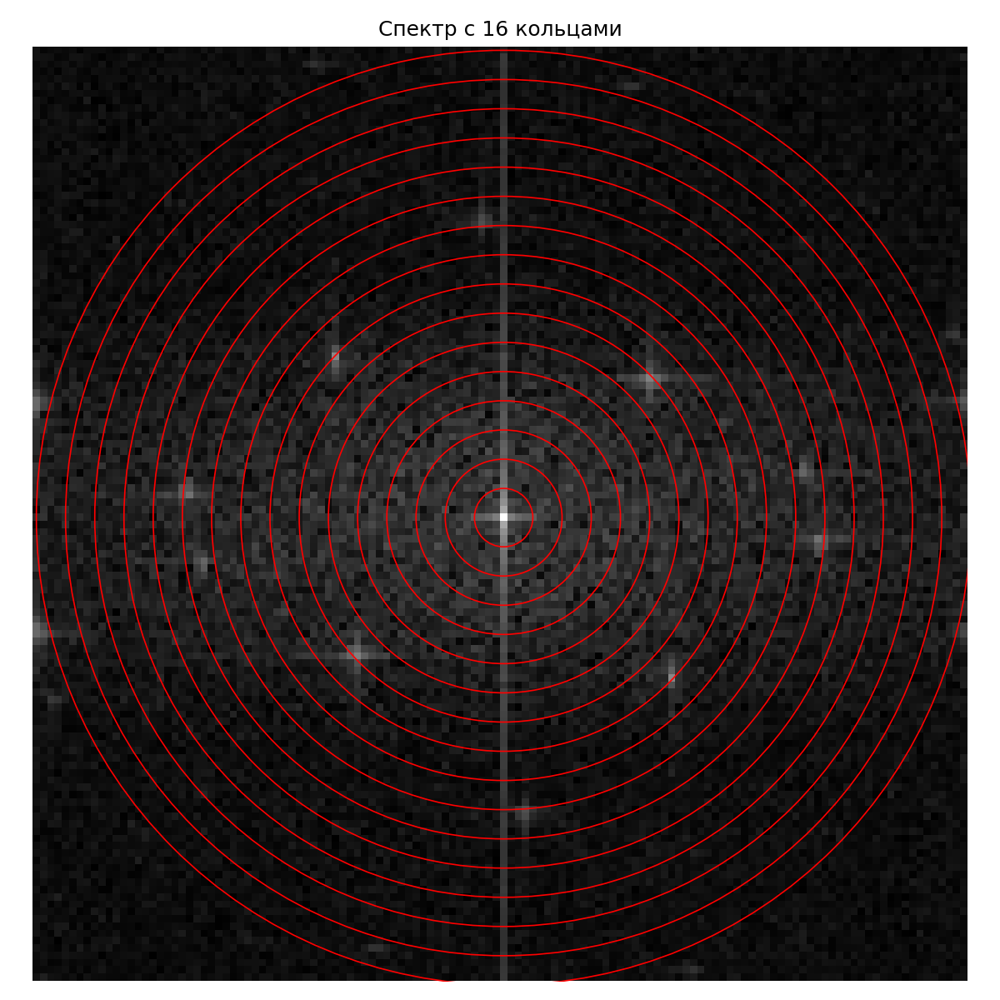
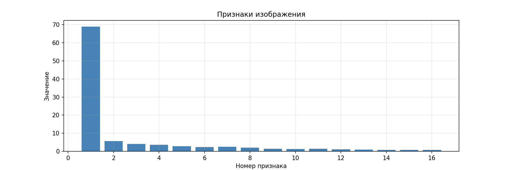
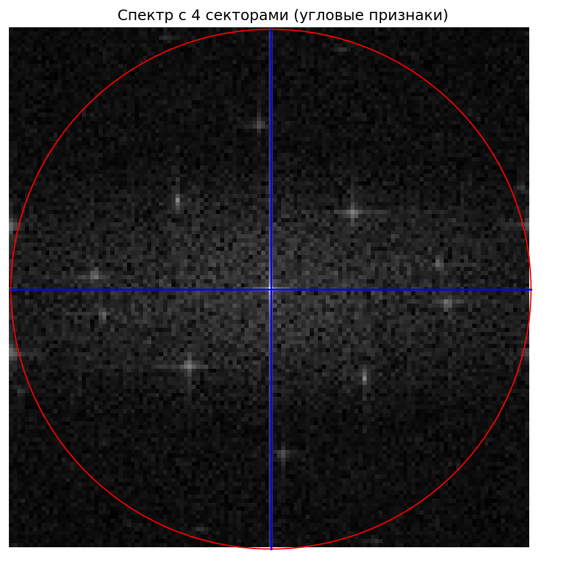
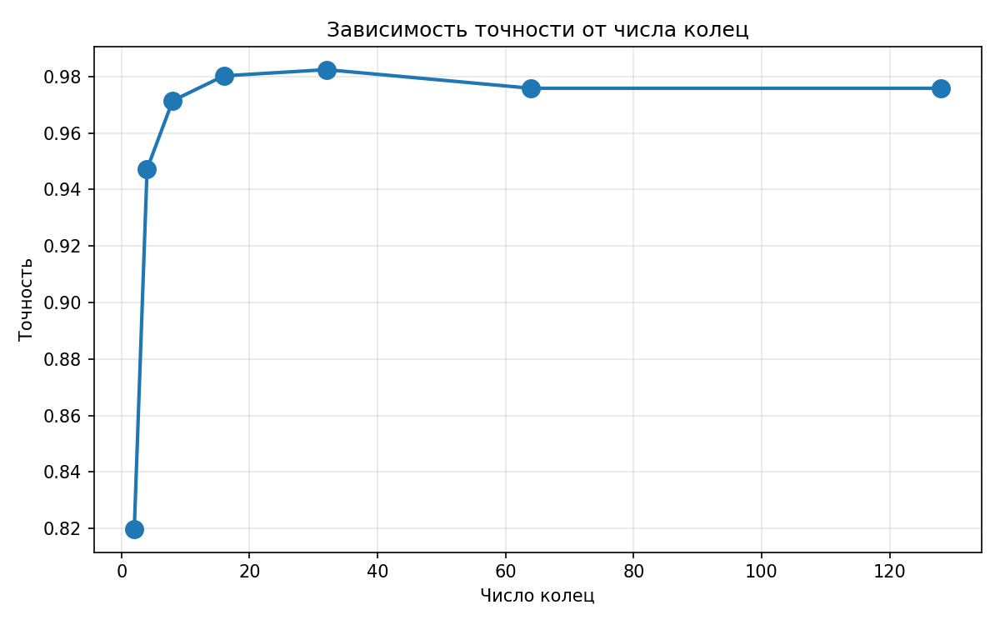
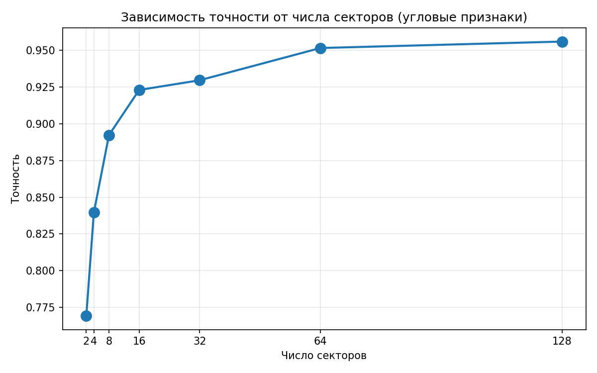

# Вычисление интегральных признаков на изображении на основе преобразования Фурье

## Общее описание проекта

Данный проект посвящён **вычислению интегральных признаков на основе преобразования Фурье** и их применению для классификации изображений.

**Что реализовано в проекте:**

1. **Вычисление признаков**  
   Из изображения получаем амплитудный спектр (2D-FFT), затем извлекаем три типа интегральных признаков:
   - кольцевые (усреднение по концентрическим кольцам)
   - угловые (усреднение по секторам)
   - статистические (среднее, дисперсия, максимум, энергия)

2. **Исследование параметров** 
   - Подбор оптимального числа колец для кольцевых признаков
   - Подбор оптимального числа секторов для угловых признаков

3. **Сравнение комбинаций признаков**  
   Тестируются 7 комбинаций для двух задач:
   - бинарная классификация (дефекты ткани): лучшая точность **98.68%**
   - многоклассовая классификация (MNIST): точность до 50%

4. **Сравнение с нейросетью**  
   Для задачи бинарной классификации (дефекты ткани) проведено сравнение метода (Фурье-признаки + Random Forest) с простой свёрточной нейронной сетью. Сравнение выполнено по точности и времени предсказания.

5. **Тестирование и предсказание**  
   - Обученная модель (комбинация кольцевых и статистических признаков, Random Forest, 98.68% точности) может предсказывать класс для нового изображения
   - Реализован скрипт `predict.py`, который загружает сохранённую модель и выводит результат (дефект / норма) для произвольного фото

**Результат:**  
- **98.68%** точности на задаче обнаружения дефектов ткани (комбинация кольцевых + статистических признаков).  
- Метод в **68 раз быстрее** простой CNN.  
- На многоклассовой задаче MNIST точность не превышает 50% — метод не подходит для распознавания изолированных объектов.

## 1. Вычисление признаков

**Основная идея преобразования Фурье** — любое изображение можно разложить на сумму синусоид и косинусоид разной частоты. Низкие частоты отвечают за плавные изменения (форма, фон), высокие — за резкие (границы, детали, шум).

**Формула (2D-дискретное преобразование Фурье):**

$$
F(u,v) = \sum_{x=0}^{M-1} \sum_{y=0}^{N-1} f(x,y) \cdot e^{-2\pi i (ux/M + vy/N)}
$$

**Где:**
- $M, N$ — размеры изображения (ширина и высота)
- $x, y$ — координаты пикселя в исходном изображении $( x \in [0, M-1], y \in [0, N-1])$
- $u, v$ — пространственные частоты по горизонтали и вертикали
- $f(x,y)$ — яркость пикселя в точке $(x,y)$
- $F(u,v)$ — комплексное число, содержит информацию об амплитуде (яркости волны) и фазе (ее сдвиге)
- $e^{-2\pi i (ux/M + vy/N)}$ — комплексная экспонента

**Амплитудный и фазовый спектр**

Результат преобразования Фурье $F(u,v)$ — комплексное число:

$$
F(u,v) = \text{Re}(u,v) + i \cdot \text{Im}(u,v)
$$

Его можно представить в тригонометрической форме:

$$
F(u,v) = |F(u,v)| \cdot e^{i \phi(u,v)}
$$

**Где:**
- $|F(u,v)| = \sqrt{\text{Re}^2(u,v) + \text{Im}^2(u,v)}$ — **амплитудный спектр** (модуль)
- $\phi(u,v) = \arctan\left(\frac{\text{Im}(u,v)}{\text{Re}(u,v)}\right)$ — **фазовый спектр** (аргумент)

Амплитудный спектр $|F(u,v)|$ показывает **интенсивность** каждой частоты в изображении.
Фазовый спектр $\phi(u,v)$ определяет **пространственное положение** частотных компонент (сдвиг).

Для построения интегральных признаков, используемых в данной работе, решающим является выбор между амплитудой и фазой:

*   **Амплитудный спектр** устойчив к сдвигу объекта. Он позволяет строить компактные признаки (кольца, секторы) и хорошо интерпретируется (низкие частоты — форма, высокие — детали).
*   **Фазовый спектр**, напротив, **чувствителен к сдвигу** (изменяется при смещении объекта даже на 1 пиксель), не инвариантен к повороту и не поддаётся усреднению по кольцам/секторам без потери смысла. Он не дает значимого прироста точности в задачах классификации.

**Таким образом, в данной работе используется только амплитудный спектр $|F(u,v)|$.**

### 1.1. Подготовка изображения и получение спектра

Для демонстрации работы метода возьмём изображение ткани **без дефекта**.

**Исходное изображение**

**Предобработка**

Изображение переводится в оттенки серого, так как преобразование Фурье работает с одним двумерным массивом чисел. Цветное изображение имеет три канала (B, G, R), а серое — один канал (яркость). Использование серого позволяет:

- Уменьшить объём данных в 3 раза
- Ускорить вычисления
- Сохранить информацию о форме и текстуре, так как цвет не является определяющим для большинства задач классификации

Затем картинка приводится к квадратному размеру 128×128 пикселей. Это необходимо для ускорения вычислений и получения круговой формы спектра.

Перед преобразованием Фурье значения яркости пикселей приводятся к диапазону [0, 1] делением на 255. Это обеспечивает численную устойчивость вычислений и соответствие стандартному определению дискретного преобразования Фурье.

**Амплитудный спектр**

`np.fft.fft2` располагает низкие частоты по углам массива, что неудобно для визуализации и построения кольцевых признаков. 

Операция `fftshift` переносит низкие частоты в центр, а высокие по краям. Это не меняет информацию, но позволяет корректно выделять кольцевые признаки.
На визуализации спектра видно яркое пятно в центре — это низкие частоты (общая форма, фон). К краям спектр темнеет — высоких частот мало, что характерно для гладкой поверхности без дефектов.

После применения 2D-FFT и сдвига низких частот в центр (`fftshift`) получаем амплитудный спектр.

### 1.2. Кольцевые признаки
---

**Кольцевые признаки** вычисляются как среднее значение по концентрическим кольцам $R_i$:

$$
f_i^{\text{(rings)}} = \frac{1}{|R_i|} \sum_{(u,v) \in R_i} |F(u,v)|
$$

**Где:**
- $f_i^{\text{(rings)}}$ — итоговый признак для $i$-го кольца.
- $R_i$ — $i$-е концентрическое кольцо с центром в заданной точке.
- $|R_i|$ — площадь кольца (количество пикселей в его области).
- $(u, v)$ — координаты пикселей в пределах $i$-го кольца.
- $F(u, v)$ — амплитуда спектра в этой координате, $|F(u, v)|$ — её модуль.

Сумма $\sum_{(u, v) \in R_i} |F(u, v)|$ даёт суммарную величину всех пикселей в кольце. Деление на $|R_i|$ вычисляет **среднее арифметическое** — итоговый кольцевой признак.

---

Разбили спектр на **16 концентрических колец**.

**Что показывают кольцевые признаки:**
- **Кольца 1–5** (центр): низкие частоты — форма, фон, чем выше значения, тем более крупный объект присутствует в кадре
- **Кольца 6–10** (средние): контуры, границы
- **Кольца 11–16** (края): высокие частоты — детали, шум

**График кольцевых признаков для данного изображения:**

**Вектор кольцевых признаков:**

[68.93 5.56 4.05 3.65 2.9 2.4 2.44 2.03 1.47 1.23 1.39 1.09 0.95 0.83 0.77 0.78]

Первое значение значительно выше последующих, что указывает на доминирование низких частот (крупные элементы структуры ткани). Однако наличие ненулевых значений вплоть до 16-го кольца свидетельствует о присутствии деталей на средних и высоких частотах — текстура не является гладкой, а имеет выраженную структуру.

### 1.3. Угловые признаки
---
Спектр разбивается на $M$ секторов. Для каждого сектора вычисляется средняя яркость.

$$
f_j^{\text{(angular)}} = \frac{1}{|S_j|} \sum_{(u,v) \in S_j} |F(u,v)|
$$

**Что означают символы:**
- $f_j^{\text{(angular)}}$ — итоговый признак для $j$-го сектора.
- $S_j$ — $j$-й сектор спектра (область между двумя лучами из центра).
- $|S_j|$ — площадь сектора (количество пикселей).
- $(u, v)$ — координаты пикселей в пределах $j$-го сектора.
- $F(u, v)$ — амплитуда спектра, $|F(u, v)|$ — её модуль.

Сумма $\sum_{(u, v) \in S_j} |F(u, v)|$ — суммарная величина всех пикселей в секторе. Деление на $|S_j|$ — **среднее арифметическое**, дающее угловой признак.

---
Разбили спектр на **4 сектора** (0°, 45°, 90°, 135°).

**Что показывают угловые признаки:**
- **Сектор 0°**: горизонтальные линии
- **Сектор 90°**: вертикальные линии
- **Секторы 45° и 135°**: диагональные линии

**Вектор угловых признаков:** 
[1.82 1.4 4.23 0.0]

Для данного изображения наблюдается ярко выраженный луч по вертикальной оси, поэтому значение в секторе 90° значительно выше остальных. Это указывает на наличие вертикальных структур в текстуре ткани. Значение 0.0 в секторе 135° означает, что в этом направлении практически отсутствуют частотные компоненты. Это характерно для текстур с ярко выраженной вертикальной ориентацией и асимметрией.

### 1.4. Статистические признаки
---
По всему спектру вычисляются четыре глобальные характеристики.

**1. Среднее (общая яркость):**

$$
f^{\text{(mean)}} = \frac{1}{N} \sum_{u,v} |F(u,v)|
$$

- $f^{\text{(mean)}}$ — среднее значение спектра.
- $N$ — общее количество пикселей спектра.
- Сумма всех значений, делённая на их число.

**2. Стандартное отклонение (контрастность):**

$$
f^{\text{(std)}} = \sqrt{\frac{1}{N} \sum_{u,v} \left( |F(u,v)| - \mu \right)^2}
$$

- $f^{\text{(std)}}$ — стандартное отклонение.
- $\mu = f^{\text{(mean)}}$ — среднее значение.
- Показывает разброс значений спектра (насколько изображение контрастное).

**3. Максимум (наличие крупного объекта):**

$$
f^{\text{(max)}} = \max_{u,v} |F(u,v)|
$$

- $f^{\text{(max)}}$ — максимальное значение спектра.
- Обычно достигается в центре (нулевая частота) и характеризует наличие крупного объекта в кадре.

**4. Общая энергия (насыщенность деталями):**

$$
f^{\text{(energy)}} = \sum_{u,v} |F(u,v)|^2
$$

- $f^{\text{(energy)}}$ — общая энергия спектра.
- Сумма квадратов всех значений — чем выше, тем больше деталей и контрастов в изображении.
---
Вычислили 4 характеристики для данного изображения.

| Признак | Формула | Что показывает |
|---------|---------|----------------|
| **Среднее** | `mean(spectrum)` | Общая яркость (светлое / тёмное) |
| **Стандартное отклонение** | `std(spectrum)` | Контрастность (резкость / размытость) |
| **Максимум** | `max(spectrum)` | Наличие крупного объекта |
| **Сумма квадратов** | `sum(spectrum²)` | Общая энергия / насыщенность деталями |

**Значения для данного изображения:**

| Признак | Значение | Интерпретация |
|---------|----------|---------------|
| Среднее | 1.46 | Нет больших гладких областей, вся поверхность структурирована |
| Стандартное отклонение | 17.58 | Контрастная текстура, резкие перепады |
| Максимум | 2223.13 | Крупный план — ткань занимает почти весь кадр |
| Сумма квадратов | 5 096 152.5 | Чёткая, не размытая структура, много деталей на высоких частотах |

## 2. Исследование параметров

Все эксперименты по подбору параметров выполнены с использованием классификатора **Random Forest** со следующими фиксированными настройками:

- `n_estimators = 100` — количество деревьев в ансамбле (достаточно для стабильности, увеличение не даёт значимого прироста)
- `random_state = 42` — фиксация случайности для воспроизводимости результатов

Выбор Random Forest обусловлен его устойчивостью к переобучению, отсутствием необходимости в нормализации признаков и хорошей работой с пространствами малой размерности.

### 2.1. Описание датасета

В работе используется **Industrial Textile Dataset**, содержащий фотографии промышленных тканей с дефектами и без.

- **Источник:** [Industrial Textile Dataset на Hugging Face](https://huggingface.co/datasets/SimTho/IndustrialTextileDataset)
- **Ссылка на использованную выборку (Google Drive):** [data](https://drive.google.com/drive/folders/1ENV74j374ypyGWaX4bswDbaRClEw4p1s?usp=drive_link)
- **Лицензия:** MIT

**Состав итогового датасета после обработки:**

| Класс | Количество |
|-------|------------|
| Норма (без дефектов) | 885 |
| Дефект | 629 |
| **Всего** | **1514** |

Все изображения взяты из оригинального датасета (без масок разметки) и объединены в две папки: `good/` и `defective/`. Датасет является основой для всех экспериментов по бинарной классификации. Подобранные параметры (число колец, секторов, размер изображения) будут использоваться в дальнейшем и для задачи многоклассовой классификации (MNIST), что подтверждает их универсальность.

### 2.2. Выбор размера входного изображения

Исходные изображения в датасете имеют размер 256×256 пикселей. Все входные изображения приводятся к квадратному размеру **128×128 пикселей** с помощью бикубической интерполяции (`cv2.resize`). Это позволяет унифицировать размер для всех экспериментов, использовать единое число кольцевых признаков, а также ускорить вычисления (спектр 128×128 считается в 4 раза быстрее, чем 256×256).

В рамках данной работы не проводилось отдельного исследования влияния размера входного изображения на точность классификации. Значение 128×128 выбрано как стандартный компромисс между скоростью вычислений и сохранением информации, а также как размер, заведомо превышающий разрешение используемых датасетов (включая 28×28 для MNIST).

**Замечание:** подбор оптимального числа колец и секторов зависит от размера изображения. Однако реализованная программа позволяет гибко менять размер входного изображения (`target_size`), а подбор числа колец и секторов выполняется автоматически для выбранного размера. Это означает, что при необходимости размер можно изменить, и эксперимент по подбору параметров будет проведён заново для нового размера. В данной работе все эксперименты выполнены для фиксированного размера 128×128.

### 2.3. Оптимальное число колец

Для определения оптимального числа колец был проведён эксперимент на датасете Industrial Textile Dataset (1514 изображений). Тестировались значения от 2 до 128. Для каждого значения обучалась модель Random Forest, оценивалась точность классификации.

**Результаты эксперимента (размер изображения 128×128):**

| Число колец | Точность |
|------------|----------|
| 2          | 81.98%   |
| 4          | 94.73%   |
| 8          | 97.14%   |
| 16         | 98.02%   |
| **32**     | **98.24%** |
| 64         | 97.58%   |
| 128        | 97.58%   |

**Анализ:**
- До 32 колец точность растёт (с 81.98% до 98.24%).
- Максимальная точность достигается при **32 кольцах**.
- При 64 и более кольцах точность снижается (избыточность признаков).

**Вывод:**  
Для выбранного размера 128×128 оптимальным является **32 кольца** (максимальная точность). В данной работе для дальнейших экспериментов выбрано **16 колец** (98.02%), так как они обеспечивают почти ту же точность при вдвое меньшем числе признаков.

**График зависимости точности от числа колец:**

На графике хорошо виден быстрый рост точности при увеличении числа колец от 2 до 16, выход на плато в районе 16–32 колец и последующее снижение при 64 и более кольцах. Это подтверждает, что оптимальным диапазоном является 16–32 кольца.

### 2.4. Подбор числа секторов

Для определения оптимального числа секторов был проведён эксперимент на датасете Industrial Textile Dataset (1514 изображений). Тестировались значения от 2 до 128 (дальнейшее увеличение не имеет физического смысла, так как при спектре 128×128 на сектор приходится менее 1 пикселя). Для каждого значения обучалась модель Random Forest только на угловых признаках, оценивалась точность классификации.

**Результаты эксперимента (размер изображения 128×128):**

| Число секторов | Точность |
|----------------|----------|
| 2 | 76.92% |
| 4 | 83.96% |
| 8 | 89.23% |
| 16 | 92.31% |
| 32 | 92.97% |
| 64 | 95.16% |
| 128 | **95.60%** |

**Анализ:**
- До 128 секторов точность растёт (с 76.92% до 95.60%).
- Максимальная точность среди физически обоснованных значений достигается при **128 секторах**.
- Дальнейшее увеличение (256, 512, 1024) даёт незначительный прирост (до 96.48%), но каждый сектор содержит менее 1 пикселя, что делает такие признаки нестабильными и трудно интерпретируемыми.

**Эксперимент проведён для значений до 1024 включительно. Однако в данной работе выборка ограничена 128 секторами как практически значимым пределом.**

**Вывод:**  
Для выбранного размера 128×128 оптимальным является **128 секторов** (95.60%). В проекте для дальнейших экспериментов выбрано **4 сектора** (83.96%), так как они обеспечивают достаточную точность для базового анализа, а также простоту интерпретации. При необходимости точность может быть повышена за счёт увеличения числа секторов.

**График зависимости точности от числа секторов:**

На графике виден устойчивый рост точности при увеличении числа секторов, с замедлением прироста после 64 секторов. Это подтверждает, что даже небольшое число секторов (4) даёт приемлемый результат, а увеличение до 128 позволяет достичь максимума.

## 3. Сравнение комбинаций признаков

### 3.1. Бинарная классификация (дефекты ткани)

После выбора оптимальных параметров (размер 128×128, 16 колец, 4 сектора) был проведён эксперимент по сравнению различных комбинаций признаков. Тестировались 7 комбинаций: только кольцевые, только угловые, только статистические, а также их попарные и полные объединения. Для каждой комбинации обучалась модель Random Forest на датасете из 1514 изображений (885 норма, 629 дефект), оценивалась точность классификации.

**Результаты эксперимента:**

| № | Комбинация признаков | Количество признаков | Точность |
|---|---------------------|---------------------|----------|
| 1 | **Кольцевые + статистические** | 20 | **98.68%** |
| 2 | Все вместе (кольца + углы + стат) | 24 | 98.46% |
| 3 | Только кольцевые | 16 | 98.02% |
| 4 | Кольцевые + угловые | 20 | 97.58% |
| 5 | Угловые + статистические | 8 | 91.43% |
| 6 | Только статистические | 4 | 87.47% |
| 7 | Только угловые | 4 | 83.96% |

**Анализ:**

- **Лучший результат (98.68%)** достигнут комбинацией **кольцевые + статистические**. Статистические признаки дополнили частотную картину общими характеристиками, что дало максимальную точность.
- **Все вместе (98.46%)** — незначительно уступает лучшему, что говорит о том, что угловые признаки не добавляют полезной информации к данной комбинации.
- **Только кольцевые (98.02%)** — всего на 0.66% ниже лучшего, что подтверждает их ключевую роль в описании изображения.
- **Кольцевые + угловые (97.58%)** — хуже, чем только кольцевые, то есть угловые признаки внесли шум.
- **Угловые + статистические (91.43%)**, **только статистические (87.47%)**, **только угловые (83.96%)** ожидаемо слабы — без кольцевых признаков точность резко падает.

**Вывод:**  
Наилучший результат (98.68%) показала комбинация **кольцевых и статистических** признаков. Кольцевые признаки являются основой метода, а добавление статистических позволяет учесть глобальные характеристики спектра.

---

### 3.2. Многоклассовая классификация (MNIST)

Для проверки универсальности метод был применён к датасету рукописных цифр MNIST (2000 изображений, 10 классов). Использовались те же параметры (128×128, 16 колец, 4 сектора) и те же 7 комбинаций признаков.

**Результаты эксперимента:**

| Комбинация признаков | Количество признаков | Точность |
|---------------------|---------------------|----------|
| Все вместе | 24 | 50.00% |
| Кольцевые + угловые | 20 | 49.33% |
| Угловые + статистические | 8 | 44.00% |
| Кольцевые + статистические | 20 | 43.33% |
| Только кольцевые | 16 | 43.17% |
| Только угловые | 4 | 39.67% |
| Только статистические | 4 | 32.33% |

**Анализ:**
- Точность на MNIST существенно ниже, чем на задаче с тканями (максимум 50%).
- Это объясняется тем, что Фурье-признаки ориентированы на анализ **глобальной частотной структуры** (текстуры, дефекты) и не обладают инвариантностью к сдвигу, что критично для распознавания изолированных объектов (цифр).
- Комбинация «все вместе» дала наилучший результат (50.00%), но он остаётся низким.

**Вывод:**  
Предложенный метод эффективен для задач, где ключевую роль играет частото-зависимая структура (дефекты на текстурах, анализ различных структур), но не подходит для распознавания изолированных объектов, требующих учёта локальной формы и положения.

## 4. Сравнение с нейросетью

Поскольку предложенный метод показал низкую эффективность на задаче распознавания изолированных объектов, сравнение с нейросетью проводилось **только для бинарной классификации дефектов ткани**, где метод достигает высокой точности (98.68%).

### 4.1. Архитектура CNN

Использовалась следующая архитектура:
- Вход: 128×128×1 (серое изображение)
- Свёрточный слой: 32 фильтра 3×3, ReLU, MaxPooling 2×2
- Свёрточный слой: 64 фильтра 3×3, ReLU, MaxPooling 2×2
- Свёрточный слой: 128 фильтров 3×3, ReLU, MaxPooling 2×2
- Flatten, Dense 128, Dropout 0.5, выходной слой sigmoid

Обучение: оптимизатор Adam, loss binary crossentropy, 10 эпох.

### 4.2. Результаты

| Метод | Точность | Время обучения | Время предсказания (1 фото) |
|-------|----------|----------------|---------------------------|
| **Фурье + Random Forest** | **98.68%** | 12.02 с | **0.000041 с** |
| CNN | 89.67% | 72.09 с | 0.002785 с |

### 4.3. Анализ

- **Точность:** предложенный метод превосходит CNN на **9.01%**.
- **Скорость обучения:** Random Forest обучается в **6 раз быстрее**.
- **Скорость предсказания:** метод Фурье быстрее CNN в **68 раз**.
- **Интерпретируемость:** признаки Фурье можно объяснить (частоты, ориентация), CNN представляет собой неинтерпретируемую систему скрытых параметров.

**Вывод:**  
Предложенный метод на основе Фурье-признаков и Random Forest превосходит простую CNN как по точности, так и по скорости, и является эффективной альтернативой для задач анализа текстур и обнаружения дефектов.

## 5. Тестирование и предсказание

Обученная модель (кольцевые + статистические признаки, Random Forest, точность 98.68%) сохранена и может использоваться для классификации новых изображений.

Скрипт `predict.py` загружает модель, вычисляет признаки для переданного фото и выводит результат: **дефект** или **норма** (с вероятностью).

## 6. Выводы

1. Предложенный метод вычисления интегральных признаков на основе Фурье показал высокую эффективность на задаче обнаружения дефектов ткани (98.68%).
2. Исследованы параметры: оптимальное число колец — 16–32, секторов — 4 (базовый) или 128–256 (максимальная точность).
3. Лучшая комбинация — кольцевые и статистические признаки (20 чисел).
4. На задаче MNIST метод неэффективен (до 50%) — это его естественное ограничение.
5. Сравнение с CNN показало превосходство по точности и скорости.
6. Разработанный метод может использоваться в системах технического зрения для контроля качества на производстве.
